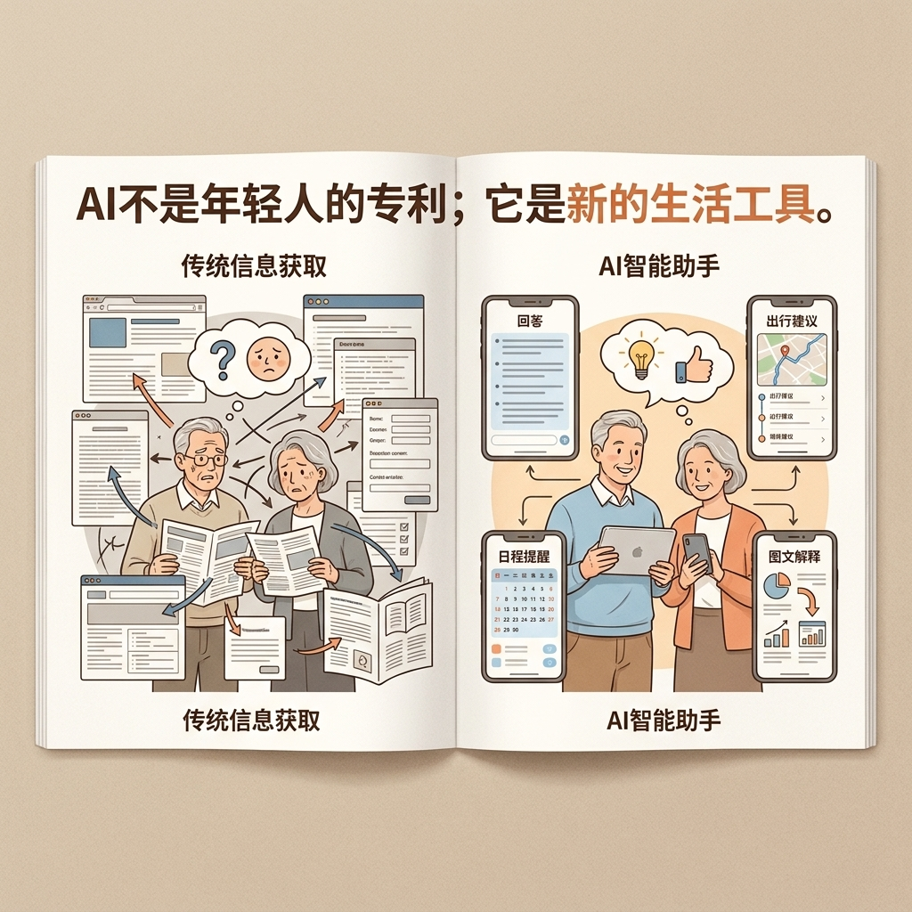
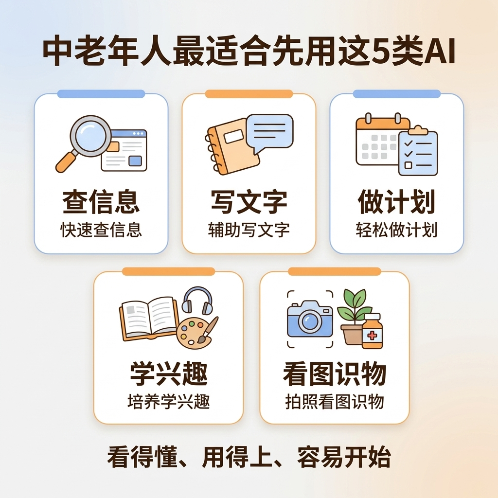
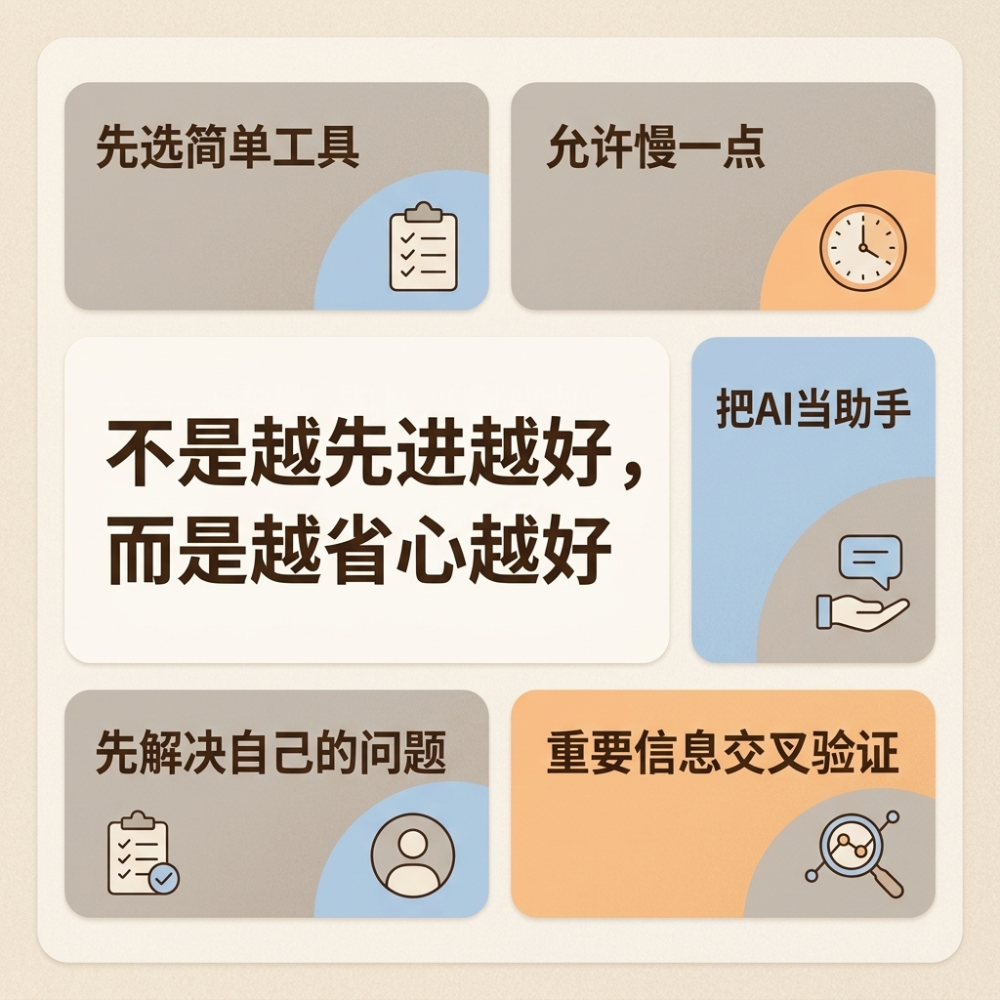

# 适合中老年人的 AI 入门指南：从听说过到真会用

这两年，“AI”几乎成了所有人都绕不开的词。

有人拿它写文章，有人拿它做图片，有人用它查资料、做计划、改文案、学知识。你会发现，不管是朋友圈、短视频，还是新闻报道，AI 好像一下子就闯进了我们的生活。

但很多中老年朋友一听到 AI，第一反应往往不是兴趣，而是距离感。有人会觉得，这是不是年轻人玩的新东西；也有人会担心，自己不会电脑、不会复杂操作，肯定学不会；还有人干脆直接下结论：这种技术离自己的生活太远了，知道一下就行，没必要真去学。

其实，这恰恰是一个很大的误解。

**AI 不是只属于年轻人的新玩具，它更应该成为中老年人提升生活效率、拓展信息能力、丰富精神生活的一个新工具。**
而且说得更直接一点，越是希望把生活过得轻松一点、明白一点、有掌控感一点的人，越值得早点了解 AI。

今天这篇文章，不讲复杂技术，也不讲高深概念，只讲一件事：**如果你是中老年人，或者你身边有爸妈长辈，应该怎么真正开始接触 AI，并把它用到生活里。**

## 一、为什么现在的中老年人，也需要了解 AI

很多人一提到 AI，总觉得那是“未来”的事，是程序员、工程师、互联网从业者的事。但今天的 AI，早就不只是实验室里的概念，也不只是专业人士手里的工具了。

它已经开始进入每一个普通人的生活场景。

比如，你想查一查某种保健知识，但又担心网上信息太杂，看不懂、分不清；比如，你准备出门旅行，想做个路线安排，又嫌自己一点点搜太麻烦；再比如，你想给孙辈写一段生日祝福，想发个朋友圈，想整理一次家庭聚会照片，想把一个复杂问题问明白——这些事，AI 都已经能帮上忙。

这也是为什么，中老年人越早接触 AI，越容易在未来几年里保持一种**不掉队、不被动、不过度依赖别人**的状态。

很多时候，我们真正想要的，不是赶时髦，而是拥有一种能力：面对越来越复杂的信息环境，自己也能看懂一点、判断一点、处理一点。过去，我们学会用智能手机，是为了不被时代甩开；今天，我们开始了解 AI，本质上也是一样的。

更重要的是，AI 对中老年人的价值，不在“炫技”，而在“实用”。

年轻人可能会拿 AI 生成海报、写代码、做商业方案；但对中老年朋友来说，AI 更重要的价值，往往是这些看起来更朴素、却真正贴近日常的事情：
**帮你把话说清楚，帮你把信息看明白，帮你把事情安排得更有条理，帮你在很多原本觉得麻烦的地方，省下一点时间和精力。**

别小看这“一点”。日子就是由这些一点点省心组成的。

## 二、很多人觉得 AI 很难，其实难的不是工具，而是第一步

很多中老年朋友不是不想学，而是一开始就被“AI”这两个字吓住了。

一听名字，就觉得很专业；一看到别人演示，又觉得节奏太快；再听人说什么模型、提示词、算法、训练数据，心里更容易犯怵。最后就变成一句熟悉的话：**“这个我学不会。”**

但说实话，今天大多数普通人使用 AI，根本不需要懂这些。

你不需要会编程，不需要懂英文，不需要学算法，更不需要先掌握什么复杂理论。对绝大多数人来说，使用 AI 的核心，其实就是一件事：**把你的问题说出来。**

你想知道什么，就问什么。
你想处理什么，就让它帮你处理什么。
你觉得它说得太复杂，就让它“讲简单一点”；你觉得太笼统，就让它“举个例子”；你觉得太快了，就让它“一步一步说”。

这跟我们过去理解的“学技术”完全不一样。以前学电脑，常常要记菜单、记步骤、记按钮。现在很多 AI 工具，反而更像是在跟一个很有耐心的人对话。你不用一开始就会，你只要敢开口，敢试，敢多问一句，门就已经进去了。

所以，中老年人学 AI 最难的，不是智力门槛，也不是年龄门槛，而是心理门槛。

很多人会担心自己问错，担心自己操作错，担心一旦弄乱了就收不回来。但现实是，大部分 AI 工具并没有那么“危险”。你多问一遍、改一句、重新来一次，成本都很低。它不像过去某些软件，一点错就不知道怎么返回。AI 更像一张可以反复写、反复擦的草稿纸。

而第一步一旦迈出去，后面就会越来越顺。

## 三、中老年人最适合从这 5 类 AI 用法开始

如果一上来就去研究最复杂的玩法，确实容易挫败。所以更好的方法，不是“什么都学”，而是先从最贴近日常生活的地方开始。

我更建议中老年朋友，从下面这 5 类应用场景入手。

### 1. 用 AI 查信息，但不是“乱搜”，而是“问明白”

很多人现在遇到问题，第一反应还是去搜索。可搜索的结果常常是一堆网页、一堆广告、一堆看起来差不多的答案，越看越乱。

AI 最大的好处，是它可以先帮你把信息整理成一个更容易理解的版本。

比如你可以直接问：
“高血压饮食上要注意什么？请用 60 岁老人能看懂的话说明白。”
“我想去杭州旅游三天，帮我安排一个轻松一点的行程。”
“麻将初学者怎么记牌？请一步一步讲。”

你会发现，AI 不只是给你答案，而是在帮你“翻译”信息。它把原本分散、复杂、专业的内容，先变成一个相对清楚的起点。

当然，医疗、投资、法律这类重要问题，不能只靠 AI 一句话下结论，还是要结合医生、专业人士或权威渠道判断。但在“先了解、先梳理、先搞明白”这个阶段，AI 真的是非常顺手的助手。

### 2. 用 AI 帮你写东西，把“不会表达”变成“有思路可改”

很多中老年朋友不是没有想法，而是卡在“怎么说”上。

比如想写一段朋友圈文案，想发一段节日祝福，想给孩子老师写个感谢，想整理一次活动感受，脑子里有内容，但落到字面上总觉得别扭。这个时候，AI 的作用特别明显。

你完全可以把自己的要求说得朴素一点，比如：
“帮我写一段生日祝福，语气真诚一点，不要太夸张。”
“帮我写一段参加社区活动后的感想，控制在 150 字左右。”
“帮我润色这段文字，让它更通顺、自然一些。”

重点不是让 AI 替你“代笔人生”，而是让它先帮你搭个架子。你在这个基础上再改一改，加上自己的真实感受，文字就会顺很多。

这对很多过去不太习惯写作的人来说，是一个特别友好的入口。因为它把“从零开始写”这件事，变成了“先有个初稿，再慢慢改”。

### 3. 用 AI 做生活计划，让复杂事情变得有条理

很多日常事务，不难，但琐碎。真正让人头疼的，不是事情本身，而是脑子里要同时装很多步骤。

比如旅游安排、家庭聚会筹备、体检前准备、看病资料整理、孩子来访时的接待计划，都是这样。自己做也不是不行，但很容易漏东西，或者反复改。

这时候，AI 的优势就出来了。它很适合帮你列清单、排步骤、做初步方案。

你可以这样问：
“帮我列一个去医院体检前的准备清单。”
“我女儿一家周末来吃饭，帮我安排一个半天的接待流程。”
“我要去上海住 5 天，主要想轻松逛逛，帮我列一个不累的出行计划。”

当事情被拆开以后，人的焦虑就会明显下降。很多时候，我们不是做不了，而是怕乱。AI 恰好能帮我们把“乱”先整理一下。

### 4. 用 AI 做兴趣学习，给自己一个新的陪练

退休之后，很多人会重新开始安排自己的时间。有的人学摄影，有的人学短视频，有的人学书法、画画、唱歌、旅游记录，也有人开始重新学英语、学历史、学养生知识。

这个阶段特别适合把 AI 当成一个“陪练”。

比如你想学智能手机摄影，可以问它：
“拍花的时候怎么构图更好看？请用简单的话解释。”
你想学普通话朗读，可以问：
“这段文字适合怎么断句和停顿？”
你想学做短视频，也可以问：
“给我一个适合中老年人拍日常生活短视频的脚本模板。”

AI 最可贵的地方，是它不会嫌你问得慢，也不会嫌你重复。现实里，很多人不好意思总去麻烦别人，尤其是不想老是问孩子、问年轻人。但跟 AI 练习，你可以反复问、换着问、慢慢问，节奏完全掌握在自己手里。

### 5. 用 AI 辅助看图识物、整理内容，降低数字生活门槛

现在很多 AI 工具已经能看图片、识别文字、帮助总结内容。对中老年人来说，这类能力其实很实用。

比如看到一张植物照片，不知道是什么，可以问；看到一张食品配料表，看不懂重点，也可以让 AI 帮你解释；拍一张药盒说明书，想知道主要用途，也可以先让 AI 帮你梳理关键点。

当然，涉及用药和诊断，最终一定要听医生和说明书原文，但在“先看懂”这一步，AI 很能帮忙。

再比如，家庭里有很多零散信息：聊天记录、活动通知、照片说明、旅游攻略、课程笔记。过去这些东西往往越积越乱，现在你可以让 AI 帮你做一个初步整理，让它帮你提炼重点、归纳清单、总结要点。这种能力，看似不起眼，实际上非常贴近日常。

## 四、真正适合中老年人的 AI 使用原则，不是“先进”，而是“省心”

很多人学 AI 容易走偏，一上来就盯着最火的功能、最新的工具、最复杂的玩法。结果越看越焦虑，越学越觉得自己跟不上。

但对于中老年人来说，使用 AI 最重要的标准，从来不是“我会不会最先进的东西”，而是：**它有没有真的让我更省心。**

所以我更建议把这几个原则记住。

**第一，先选简单工具，不要贪多。**
别一开始就下载一堆 App，也别想着一周之内把所有功能都摸透。先找到一个顺手的入口，把“问问题—看答案—继续追问”这个基本流程跑通，比什么都重要。

**第二，先解决自己的问题，不要追热点。**
别人拿 AI 做视频、生成海报、剪辑大片，那是别人的使用场景。你真正要关心的是：它能不能帮你把自己的生活问题解决掉。能帮你做好旅行计划、帮你写清楚一段话、帮你看明白一份信息，这就已经很有价值了。

**第三，允许自己慢一点。**
有些人一学新东西就急，觉得第一天没学会，就是自己不行。其实完全没必要。中老年人学 AI，最好的节奏不是快，而是稳。今天学会提问，明天学会追问，后天学会让它换一种说法，这就已经是在进步。

**第四，把 AI 当助手，不要当“最终答案”。**
它可以辅助你、启发你、整理你，但不能替代你的判断。尤其是在健康、财务、法律、重大决策这些问题上，一定要把 AI 当成参考，而不是最后拍板的人。

**第五，越是重要的信息，越要交叉验证。**
这是一个特别关键的习惯。AI 说得再像回事，也不能代表 100% 正确。好的使用方式不是完全相信，也不是完全排斥，而是学会把它当作一个高效率的第一轮助手，然后再去核对更可靠的信息来源。

## 五、开始学 AI，不需要报班，先做好这 3 件小事

很多人一说学习，马上就联想到报课、买书、做笔记、系统训练。可 AI 入门其实没有那么重。

如果你现在想开始，我建议先做这 3 件事。

### 第一件：先学会“开口问”

这是最重要的一步。不要一上来就想“我该怎么系统掌握 AI”，你先试着问它一个跟自己生活最相关的问题。

比如：
“帮我安排一个适合老年人的三天旅游计划。”
“帮我写一段发朋友圈的话，主题是今天和老朋友聚会。”
“请把这段复杂的话解释得更通俗一点。”

只要你开始问，学习就已经开始了。

### 第二件：把问题问得更具体一点

很多人第一次用 AI，觉得答案不够好，往往不是工具不行，而是问题太大、太空。

比如你只问“怎么养生”，那它给出来的内容很可能也很泛。可如果你问：
“60 岁以上人群，平时饮食上有哪些容易忽视的养生细节？请列 5 点，讲得具体一点。”
答案通常就会好很多。

所以，与其追求“高级提问”，不如先记住一个简单原则：**把你的年龄、场景、目的说清楚。**
这对中老年人用 AI 特别有帮助，因为你的生活问题往往都非常具体，具体就意味着更容易得到有用的回答。

### 第三件：把 AI 用进一个固定生活场景里

最怕的是，今天试一下，明天丢一边，最后只留下“我好像用过”。真正能形成习惯的方式，是把它放进一个固定场景里。

比如你规定自己：
每次出门旅行前，用 AI 帮我列清单；
每次发朋友圈前，用 AI 帮我润色一句话；
每次看到看不懂的信息时，先让 AI 帮我解释一遍。

一旦它进入了某个固定动作，AI 就不再是一个抽象概念，而会慢慢变成你生活里的一个顺手工具。

## 结尾：AI 不是替代人，而是帮人把日子过得更轻松一点

很多人担心，AI 来了，是不是人会被替代；也有人担心，自己年纪大了，再学这些是不是已经晚了。

我反而觉得，真正值得关心的，从来不是“能不能追上所有技术”，而是**能不能在变化越来越快的时代里，给自己多留一个工具，多留一点主动性。**

对中老年人来说，学 AI 不是为了证明自己多前沿，也不是为了变成技术达人，而是为了让很多原本麻烦的事情，变得更简单一点；让很多原本看不懂的信息，变得更明白一点；让自己的生活，在数字化时代里，多一份从容，少一点无措。

说到底，技术最好的样子，不是高高在上，而是落回日常。
不是让人仰望，而是让人用得上。

**AI 也一样。**

如果你愿意，现在就可以从一个最小的问题开始。
先问一句，先试一次，先用起来。

你不需要一下子变成高手。
你只需要迈出第一步。

因为很多新生活，往往不是从“我全懂了”开始的，
而是从一句很普通的话开始——

**“这个，我也来试试看。”**

